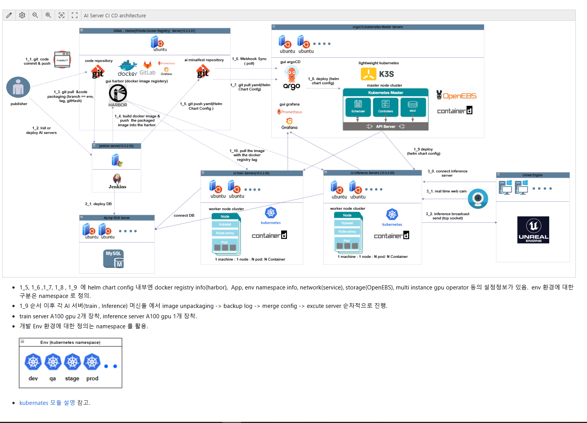

# AI Inference Server

이 프로젝트는 Twisted 프레임워크 기반의 **AI Inference 서버**로,
학습된 AI 모델을 로딩한 후 클라이언트 요청에 따라 **검증 및 추론(Inference)** 기능을 수행합니다.
기존 예측(Prediction) 서버를 확장하여, **비동기 TCP/UDP 통신 기반의 고성능 서버 구조**로 개발되었습니다.

AI 기능 자체보다도 **Python 기반 서버 구조의 확장성과 유연성**에 중점을 두었으며,
**싱글 스레드 기반의 비동기 아키텍처(Node.js와 유사)**를 Python 환경에서 구현하였습니다.
멀티스레드 구현이 까다로운 Python의 제약을 극복하기 위해,
**Twisted 네트워크 모듈**을 선택하여 **AI API 호출에 최적화된 비동기 처리 구조**를 설계하였습니다.

실제 상용 프로젝트인 **'킹오브 파이터 올스타'** 개발 당시,
성능 테스트 클라이언트(봇)를 Python + Twisted 기반으로 구성했던 경험을 바탕으로 설계되었으며,
**프로세스 스케일아웃 구조 + Command 패턴**을 활용하여 다음
아래와 같은 테스트를 수행할 수 있도록 설계되었습니다.

- **Load Test** (부하 테스트)
- **Stress Test** (한계 테스트)
- **Soak Test** (지속 테스트)
- **Failover Test** (장애 복구 테스트)
- **Concurrency Test** (동시성 테스트)

이러한 구조는 향후 다양한 AI 모델과 클라이언트 환경에 유연하게 대응할 수 있도록 확장 가능합니다.


---

## 🤖 AI 기반 실시간 추론 서버의 설계 및 구현

본 프로젝트는 단순한 백엔드 서버가 아닌,
AI 모델의 추론 결과를 실시간으로 받아 처리하고,
이를 UDP를 통해 외부 엔진(Unreal 등)으로 브로드캐스팅하는 **AI-실시간 통신 특화 서버**입니다.

### 현재 프로젝트의 기술적 특징:
- Twisted 기반 비동기 Python 서버 구조
- AI Inference 모델 연동 (학습은 별도 서버에서 수행)
- UDP 기반 결과 전송 (버추얼 휴먼 제어용)
- 프로세스 스케일아웃 + Command 패턴 적용
- K3s + Helm + ArgoCD 기반 DevOps 운영 구조

### 주요 차별성:
- **정점 데이터 송신 방식과의 차이**:
  단순한 모션 좌표 재생이 아니라,
  **AI가 상황을 해석하여 새로운 모션을 실시간으로 생성**함.
- **학습과 추론의 분리 아키텍처**:
  학습 서버는 모델을 학습하고,
  인퍼런스 서버는 이를 기반으로 **실시간 해석 및 반응 생성**을 수행.

이 서버는 향후 감정 추론, 행동 예측, 가상 아바타 제어, 스마트 방송 등 다양한 실시간 AI 서비스에 확장 가능한 구조로 설계되었습니다.

---

## 🛠️ AI 서버용 CI/CD 아키텍처

본 프로젝트는 단순 AI 추론 서버를 넘어서, **AI 학습 서버와 Inference 서버전체를 포함하는 DevOps 기반 CI/CD 파이프라인**을 구현하였습니다.



### 🔁 전체 구성 요소 요약

- **코드 저장소**: Git + GitLab / GitHub
- **패키징 및 빌드**: Jenkins → Docker → Harbor (Private Registry)
- **CI 파이프라인 자동화**: Helm Chart + GitOps 기반 ArgoCD 구성
- **Kubernetes 환경**: K3s (경량화 마스터 노드) + containerd
- **AI 추론 서버 배포**: Helm Chart 기반으로 namespace 단위 배포
- **모델 서빙 및 테스트**: Inference 서버는 실시간 카메라 데이터 수신 및 UDP로 결과 전송
- **유니티/언리얼 등 외부 엔진 연동 가능**: 실시간 방송/시각화까지 확장 가능

### 🚀 구성 목적

- 추론 서버와 학습 서버를 동일한 CI/CD 파이프라인에서 관리
- A100 GPU 서버와 일반 GPU inference 서버를 분리 운영
- multi-env(namespace), multi-instance, Helm 자동화 구성
- 빠른 rollback과 업데이트, GPU 리소스 할당 최적화

> ※ 실제 배포 구조는 `train`과 `inference` 서버를 분리하여 각각의 Helm Chart로 관리되며,
> Inference 서버는 Node 1대, Pod N개 구성으로 수평 확장됩니다.

---

## 🔧 프로젝트 구조

```
INFERENCESERVER/
├── aiServer/               # 추론 서버 핵심 모듈 (Twisted 서버 실행,클라이언트 처리, AI 인터페이스 등)
│   ├── packetHandler/      # 패킷 처리 관련 모듈
│   ├── aiFacade.py         # AI 기능 호출을 위한 중간 레이어
│   ├── client*.py          # 클라이언트 연결/관리 관련 모듈
│   ├── main.py             # 서버 엔트리 포인트
│   ├── server.py           # Twisted 기반 서버 구성
│   ├── udpClient.py        # UDP 클라이언트 관련 처리
│
├── bot/                    # (옵션) 자동화 봇 관련 모듈
│
├── commonlib/              # 공통 유틸리티 및 AI 모듈
│   ├── ai/                 # AI 모델 로딩, 노드 구성, 데이터 처리
│   │   ├── aiDataCreator.py
│   │   ├── aiNode.py
│   │   ├── model.py
│
├── factory/                # TCP 패킷 및 서버/클라이언트 Factory 정의
│   ├── tcp/
│       ├── gClientFactory.py
│       ├── gServerFactory.py
│       ├── packetFactory.py
│
├── netlib/                 # HTTP/UDP 네트워크 레이어 정의
│   ├── http/
│       ├── client/
│       ├── server/
│   ├── udp/
│
├── util/                   # 설정 로딩 및 공통 로깅/오류 처리 모듈
│   ├── configLoader.py
│   ├── fileLoader.py
│   ├── gconf.py
│   ├── gerror.py
│   ├── glog.py
│
├── config/                 # 환경 설정 파일 디렉토리
├── configServer/           # Config 서버 관련 구성
├── log/                    # 로그 출력 디렉토리
├── pm2/                    # pm2 프로세스 매니저 관련 설정
├── proto/                  # 프로토콜 정의(protoBuf 등)
├── service_group/          # (옵션) 서비스 그룹화 설정
│
├── Dockerfile              # 전체 서비스용 도커 설정
├── Dockerfile-configServer# Config 서버 전용 도커 설정
├── requirements.txt        # 전체 서비스 의존성 목록
├── requirements-configServer.txt # Config 서버 의존성 목록
```

---

## ⚙️ 주요 기술 스택

- **Python 3.x**
- **Twisted**: 비동기 네트워크 서버 프레임워크
- **AI 모델**: PyTorch or TensorFlow 기반 추론 모델 사용 가능
- **gRPC / TCP / UDP 통신**
- **Docker + pm2**: 프로세스/배포 환경 구성

---

## 🚀 실행 방법

```bash
# 의존성 설치
pip install -r requirements.txt

# 서버 실행 (Twisted main)
python aiServer/main.py
```

---

## 🧪 테스트 및 Inference API 사용 예

향후 추가 예정: `test_client.py` 또는 cURL 요청 예시

---

## 🗂️ 추가 개발시 참고

- 새로운 모델을 추가하려면: `commonlib/ai/model.py` 확장
- 클라이언트 연결 설정은: `aiServer/clientConnection.py`, `factory/tcp/*.py`
- AI 추론 흐름은: `aiServer/aiFacade.py` → `commonlib/ai/*` 으로 이어짐

---

## 📦 Docker 사용법 (선택)

```bash
docker build -t inference-server .
docker run -p 9000:9000 inference-server
```

---

## 👤 작성자 및 문의

- 주 개발자: InHeeKwak
- 문의: kwak2248@gmail.com
